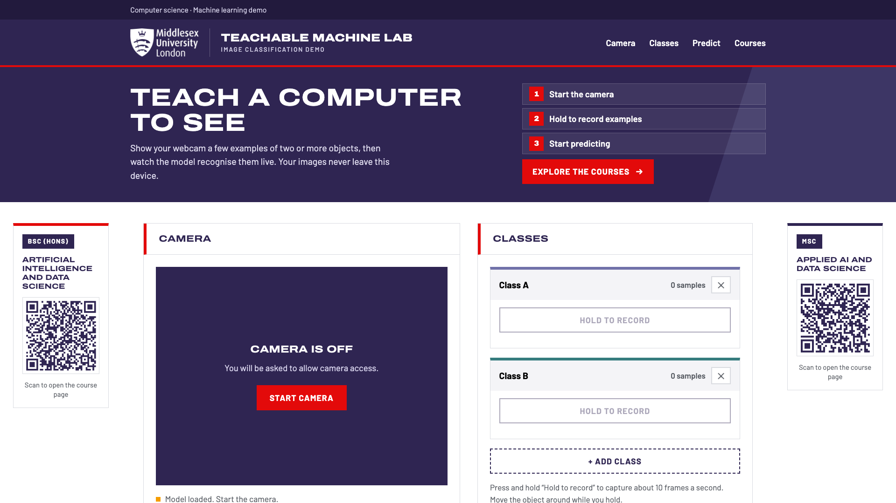
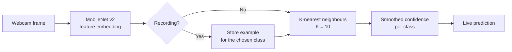

<div align="center">

# Teachable Machine Lab

**Teach a computer to see, using nothing but your webcam.**

Train an image classifier in seconds. No install, no account, and no images ever leave your device.

[](https://emfink.github.io/)


<br>



</div>

---

## Overview

Teachable Machine Lab is an interactive demonstration of how image classification works. You show your webcam a few examples of two or more objects, and the model learns to tell them apart. Predictions then update live, with a confidence score for every class.

It is built for teaching, open days and classroom demos. It runs on any device with a camera, and the whole app is a single static HTML file.

## Features

- **Live webcam capture** with hold-to-record, collecting about 10 examples per second.
- **Any number of classes.** Rename them, add more, or delete them at any time.
- **Instant learning.** There is no separate training step, so predictions work as soon as two classes have examples.
- **Real-time predictions** with a confidence bar for each class and the best match drawn on the video.
- **Private by design.** Frames are processed locally and are never uploaded or stored.
- **Responsive.** The layout adapts from phones to 4K displays, with QR codes in the side margins on wide screens.

## Quick start

1. Open **https://emfink.github.io/**.
2. Click **Start camera** and allow camera access.
3. Under each class, press and hold **Hold to record** while showing an object to the camera. Move it around for about 20 to 30 examples. Use **+ Add class** for more objects.
4. Click **Start predicting** and watch the best match update live.

### Tips for better results

- Record from different angles, distances and backgrounds.
- Give each class a similar number of examples.
- Keep the object clearly in view and well lit.
- If two classes get confused, add more varied examples to both.

## How it works



1. Each webcam frame is turned into a compact numeric description (an *embedding*) by **MobileNet v2**, a neural network pre-trained on millions of images.
2. While you record, the embeddings are stored against the class you chose.
3. To predict, a **K-nearest-neighbours** classifier (K = 10) compares the current frame with every stored example and votes on the closest class.
4. Confidence values are smoothed over a few frames so the display stays steady.

Because the heavy lifting is done by the pre-trained network, only a handful of examples per class is needed.

## Tech stack

| Part | Choice |
| --- | --- |
| App | One static `index.html`, with plain JavaScript, HTML and CSS |
| Model | [MobileNet v2](https://github.com/tensorflow/tfjs-models/tree/master/mobilenet) (`@tensorflow-models/mobilenet` 2.1.1) |
| Classifier | [KNN classifier](https://github.com/tensorflow/tfjs-models/tree/master/knn-classifier) (`@tensorflow-models/knn-classifier` 1.2.6) |
| Runtime | [TensorFlow.js](https://www.tensorflow.org/js) 4.22.0 |
| Fonts | Archivo and Barlow (Google Fonts) |
| Hosting | GitHub Pages |

TensorFlow.js and the model load from a CDN on first visit, so an internet connection is needed the first time.

## Privacy

Everything happens on your device. Camera frames are never sent to a server, and nothing is saved. Reloading the page clears all recorded examples.

## Run locally

```bash
git clone https://github.com/emfink/emfink.github.io.git
cd emfink.github.io
python3 -m http.server 8000
```

Then open <http://localhost:8000>. The camera needs a secure context, so use `localhost` or `https`. Opening `index.html` directly from disk (`file://`) will not work.

## Project structure

```text
.
├── index.html          # the whole application
├── assets/
│   └── screenshot.png  # image used in this README
└── README.md
```

## Study at Middlesex

This is a course demo for the computing and AI degrees at Middlesex University London:

- **BSc (Hons)** [Artificial Intelligence and Data Science](https://www.mdx.ac.uk/courses/undergraduate/artificial-intelligence-and-data-science-bsc-honours/)
- **MSc** [Applied AI and Data Science](https://www.mdx.ac.uk/courses/postgraduate/applied-ai-and-data-science-msc/)

> This is a course demo and not an official Middlesex University website. The Middlesex name and logo belong to Middlesex University.

## Acknowledgements

- Inspired by Google's [Teachable Machine](https://teachablemachine.withgoogle.com/).
- Built on [TensorFlow.js](https://www.tensorflow.org/js) and the pre-trained MobileNet model.
- A rewrite of an earlier Streamlit teachable-machine demo.

Maintained by [@emfink](https://github.com/emfink).
